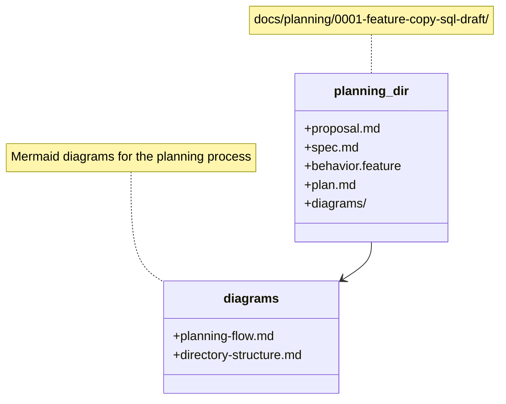

# Planning Directory Structure

```mermaid
classDiagram
    class planning_dir {
        +proposal.md
        +spec.md
        +behavior.feature
        +plan.md
        +diagrams/
    }
    class diagrams {
        +planning-flow.md
        +directory-structure.md
    }
    planning_dir --> diagrams

    note for planning_dir "docs/planning/0001-feature-copy-sql-draft/"
    note for diagrams "Mermaid diagrams for the planning process"
```
