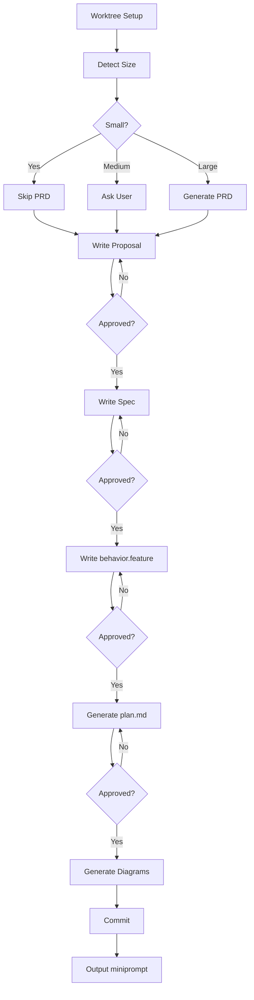

# Planning Process Flow

```mermaid
flowchart TD
    A[Worktree Setup] --> B[Detect Size]
    B --> C{Small?}
    C -->|Yes| D[Skip PRD]
    C -->|Medium| E[Ask User]
    C -->|Large| F[Generate PRD]
    D --> G[Write Proposal]
    E --> G
    F --> G
    G --> H{Approved?}
    H -->|No| G
    H -->|Yes| I[Write Spec]
    I --> J{Approved?}
    J -->|No| I
    J -->|Yes| K[Write behavior.feature]
    K --> L{Approved?}
    L -->|No| K
    L -->|Yes| M[Generate plan.md]
    M --> N{Approved?}
    N -->|No| M
    N -->|Yes| O[Generate Diagrams]
    O --> P[Commit]
    P --> Q[Output miniprompt]
```
