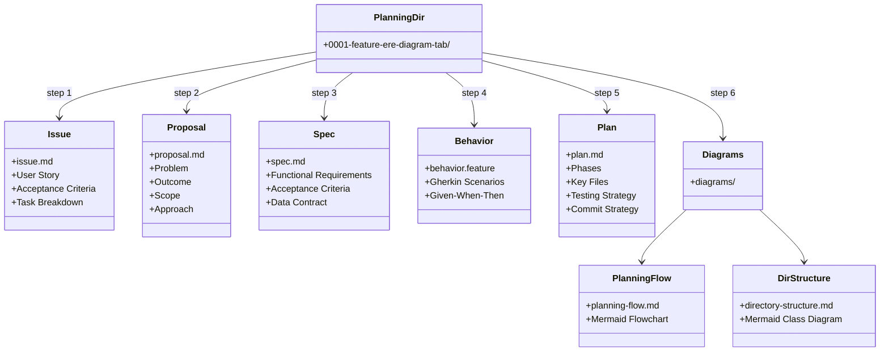

# Planning Directory Structure

```mermaid
classDiagram
    class PlanningDir {
        +0001-feature-ere-diagram-tab/
    }

    class Issue {
        +issue.md
        +User Story
        +Acceptance Criteria
        +Task Breakdown
    }

    class Proposal {
        +proposal.md
        +Problem
        +Outcome
        +Scope
        +Approach
    }

    class Spec {
        +spec.md
        +Functional Requirements
        +Acceptance Criteria
        +Data Contract
    }

    class Behavior {
        +behavior.feature
        +Gherkin Scenarios
        +Given-When-Then
    }

    class Plan {
        +plan.md
        +Phases
        +Key Files
        +Testing Strategy
        +Commit Strategy
    }

    class Diagrams {
        +diagrams/
    }

    class PlanningFlow {
        +planning-flow.md
        +Mermaid Flowchart
    }

    class DirStructure {
        +directory-structure.md
        +Mermaid Class Diagram
    }

    PlanningDir --> Issue : step 1
    PlanningDir --> Proposal : step 2
    PlanningDir --> Spec : step 3
    PlanningDir --> Behavior : step 4
    PlanningDir --> Plan : step 5
    PlanningDir --> Diagrams : step 6
    Diagrams --> PlanningFlow
    Diagrams --> DirStructure
```
