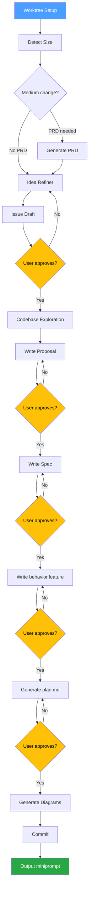

# Planning Process Flow

```mermaid
flowchart TD
    A[Worktree Setup] --> B[Detect Size]
    B --> C{Medium change?}
    C -->|No PRD| D[Idea Refiner]
    C -->|PRD needed| E[Generate PRD]
    E --> D
    D --> F[Issue Draft]
    F --> G{User approves?}
    G -->|No| D
    G -->|Yes| H[Codebase Exploration]
    H --> I[Write Proposal]
    I --> J{User approves?}
    J -->|No| I
    J -->|Yes| K[Write Spec]
    K --> L{User approves?}
    L -->|No| K
    L -->|Yes| M[Write behavior.feature]
    M --> N{User approves?}
    N -->|No| M
    N -->|Yes| O[Generate plan.md]
    O --> P{User approves?}
    P -->|No| O
    P -->|Yes| Q[Generate Diagrams]
    Q --> R[Commit]
    R --> S[Output miniprompt]

    style A fill:#4a9eff,color:#fff
    style S fill:#28a745,color:#fff
    style G fill:#ffc107,color:#000
    style J fill:#ffc107,color:#000
    style L fill:#ffc107,color:#000
    style N fill:#ffc107,color:#000
    style P fill:#ffc107,color:#000
```
