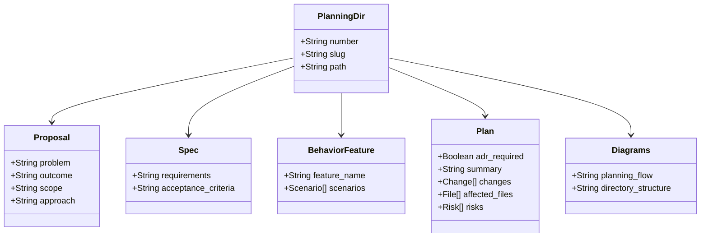

# Planning Directory Structure

```mermaid
classDiagram
    class PlanningDir {
        +String number
        +String slug
        +String path
    }
    
    class Proposal {
        +String problem
        +String outcome
        +String scope
        +String approach
    }
    
    class Spec {
        +String requirements
        +String acceptance_criteria
    }
    
    class BehaviorFeature {
        +String feature_name
        +Scenario[] scenarios
    }
    
    class Plan {
        +Boolean adr_required
        +String summary
        +Change[] changes
        +File[] affected_files
        +Risk[] risks
    }
    
    class Diagrams {
        +String planning_flow
        +String directory_structure
    }
    
    PlanningDir --> Proposal
    PlanningDir --> Spec
    PlanningDir --> BehaviorFeature
    PlanningDir --> Plan
    PlanningDir --> Diagrams
```
