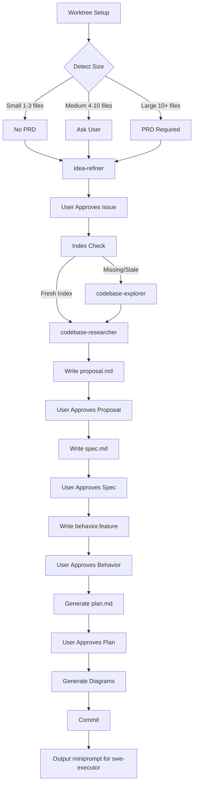

# Planning Process Flow

```mermaid
flowchart TD
    A[Worktree Setup] --> B{Detect Size}
    B -->|Small 1-3 files| C[No PRD]
    B -->|Medium 4-10 files| D[Ask User]
    B -->|Large 10+ files| E[PRD Required]
    
    C --> F[idea-refiner]
    D --> F
    E --> F
    
    F --> G[User Approves Issue]
    G --> H[Index Check]
    
    H -->|Fresh Index| I[codebase-researcher]
    H -->|Missing/Stale| J[codebase-explorer]
    J --> I
    
    I --> K[Write proposal.md]
    K --> L[User Approves Proposal]
    L --> M[Write spec.md]
    M --> N[User Approves Spec]
    N --> O[Write behavior.feature]
    O --> P[User Approves Behavior]
    P --> Q[Generate plan.md]
    Q --> R[User Approves Plan]
    R --> S[Generate Diagrams]
    S --> T[Commit]
    T --> U[Output miniprompt for swe-executor]
```
