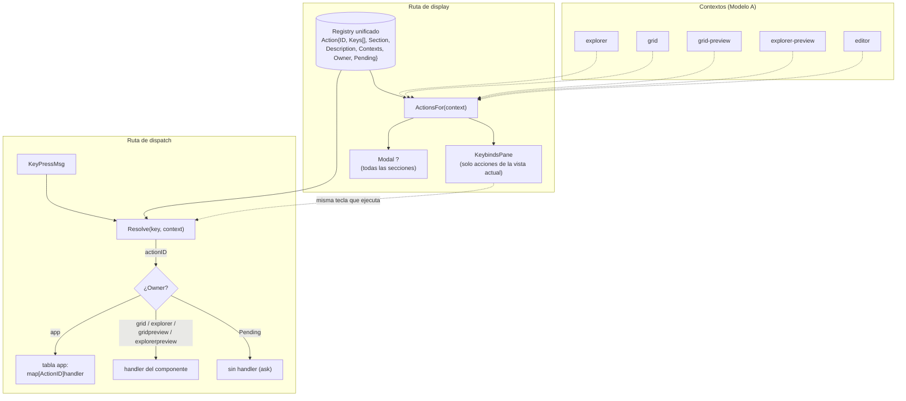
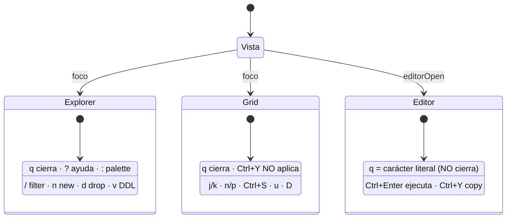

# Feature flow — Keybinds single source (display + dispatch)

Derivado de `behavior.feature`: la misma entrada alimenta las dos rutas.

## Casos clave del comportamiento

- `q` → presente en Explorer/Grid/GridPreview/ExplorerPreview; **ausente en Editor** (se inserta literal).
- `Ctrl+Y` (`copy_sql`) → solo en Editor; ausente en Grid.
- `ask` (`a`) → declarada con `Pending: true`; conserva tecla y metadata, sin handler de TUI.
- Sin rótulo "Global": el panel muestra únicamente `ActionsFor(vista actual)`.
