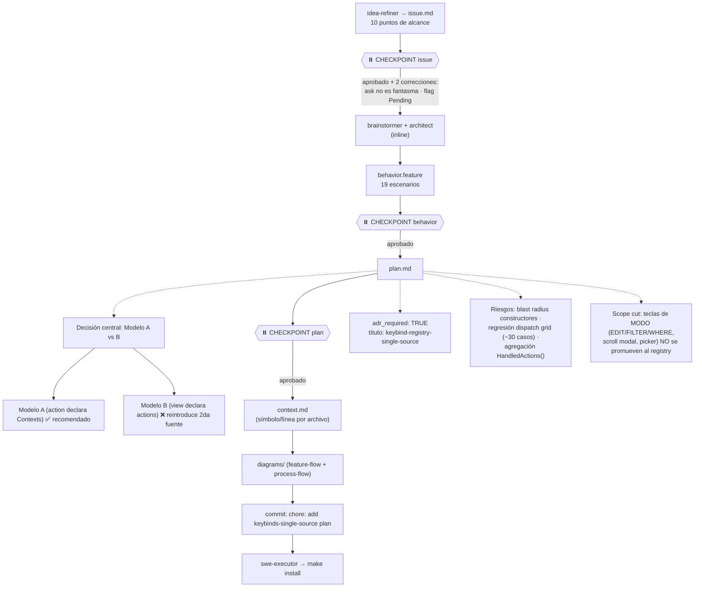

# Process flow — plan `keybinds-single-source`

Flujo de planeación específico de este cambio (slug real, decisiones tomadas).

## Decisiones registradas
- **Modelo A** elegido: una sola lista plana de acciones; `Contexts` inline; sin duplicación de IDs.
- **Dispatch table-driven** en `app` + `Resolve` en componentes; display desde `ActionsFor`.
- **`Pending bool`** para `ask` (evita falso positivo en el test acción↔handler).
- **Docs**: borrar `KEYBINDS.md`, limpiar README, crear `FEATURES.md`, actualizar checklist `AGENTS.md`.
