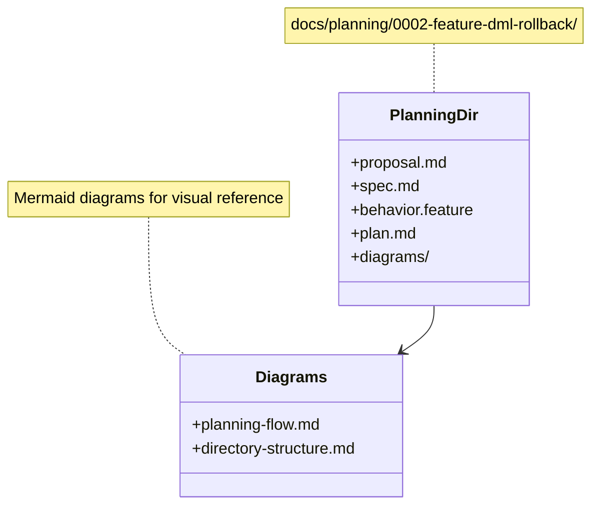

# Planning Directory Structure

```mermaid
classDiagram
    class PlanningDir {
        +proposal.md
        +spec.md
        +behavior.feature
        +plan.md
        +diagrams/
    }

    class Diagrams {
        +planning-flow.md
        +directory-structure.md
    }

    PlanningDir --> Diagrams

    note for PlanningDir "docs/planning/0002-feature-dml-rollback/"
    note for Diagrams "Mermaid diagrams for visual reference"
```
