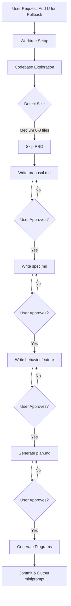

# Planning Process Flow

```mermaid
flowchart TD
    A[User Request: Add U for Rollback] --> B[Worktree Setup]
    B --> C[Codebase Exploration]
    C --> D{Detect Size}
    D -->|Medium 6-8 files| E[Skip PRD]
    E --> F[Write proposal.md]
    F --> G{User Approves?}
    G -->|Yes| H[Write spec.md]
    G -->|No| F
    H --> I{User Approves?}
    I -->|Yes| J[Write behavior.feature]
    I -->|No| H
    J --> K{User Approves?}
    K -->|Yes| L[Generate plan.md]
    K -->|No| J
    L --> M{User Approves?}
    M -->|Yes| N[Generate Diagrams]
    M -->|No| L
    N --> O[Commit & Output miniprompt]
```
