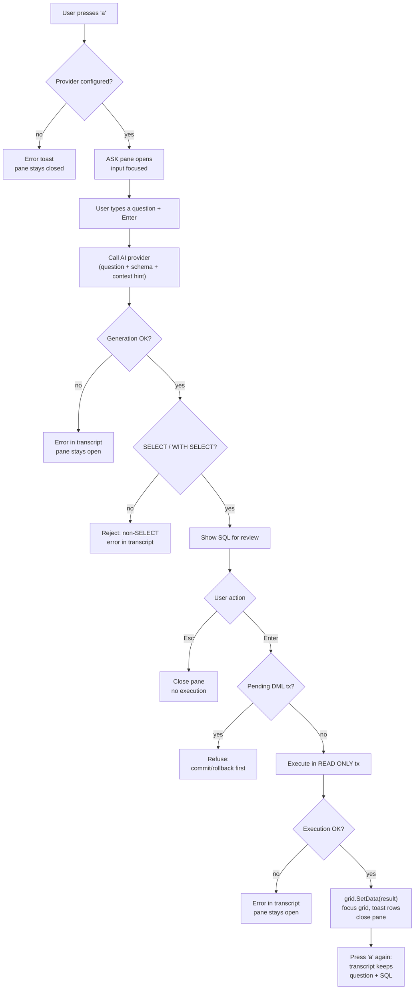

# Feature flow: ASK (NL→SQL chat)

```mermaid
flowchart TD
    A["User presses 'a'"] --> B{Provider configured?}
    B -- no --> B1["Error toast<br/>pane stays closed"]
    B -- yes --> C["ASK pane opens<br/>input focused"]

    C --> D["User types a question + Enter"]
    D --> E["Call AI provider<br/>(question + schema + context hint)"]
    E --> F{Generation OK?}
    F -- no --> F1["Error in transcript<br/>pane stays open"]
    F -- yes --> G{SELECT / WITH SELECT?}
    G -- no --> G1["Reject: non-SELECT<br/>error in transcript"]
    G -- yes --> H["Show SQL for review"]

    H --> I{User action}
    I -- Esc --> I1["Close pane<br/>no execution"]
    I -- Enter --> J{Pending DML tx?}
    J -- yes --> J1["Refuse:<br/>commit/rollback first"]
    J -- no --> K["Execute in READ ONLY tx"]
    K --> L{Execution OK?}
    L -- no --> L1["Error in transcript<br/>pane stays open"]
    L -- yes --> M["grid.SetData(result)<br/>focus grid, toast rows<br/>close pane"]

    M --> N["Press 'a' again:<br/>transcript keeps<br/>question + SQL"]
```
