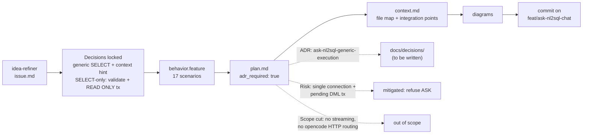

# Planning flow: 0003-feature-ask-nl2sql-chat

```mermaid
flowchart LR
    I["idea-refiner<br/>issue.md"] --> D["Decisions locked<br/>generic SELECT + context hint<br/>SELECT-only: validate + READ ONLY tx"]
    D --> B["behavior.feature<br/>17 scenarios"]
    B --> P["plan.md<br/>adr_required: true"]
    P --> C["context.md<br/>file map + integration points"]
    C --> G["diagrams"]
    G --> Z["commit on<br/>feat/ask-nl2sql-chat"]

    P -. "ADR: ask-nl2sql-generic-execution" .-> ADR["docs/decisions/<br/>(to be written)"]
    P -. "Risk: single connection +<br/>pending DML tx" .-> R["mitigated: refuse ASK"]
    P -. "Scope cut: no streaming,<br/>no opencode HTTP routing" .-> S["out of scope"]
```
