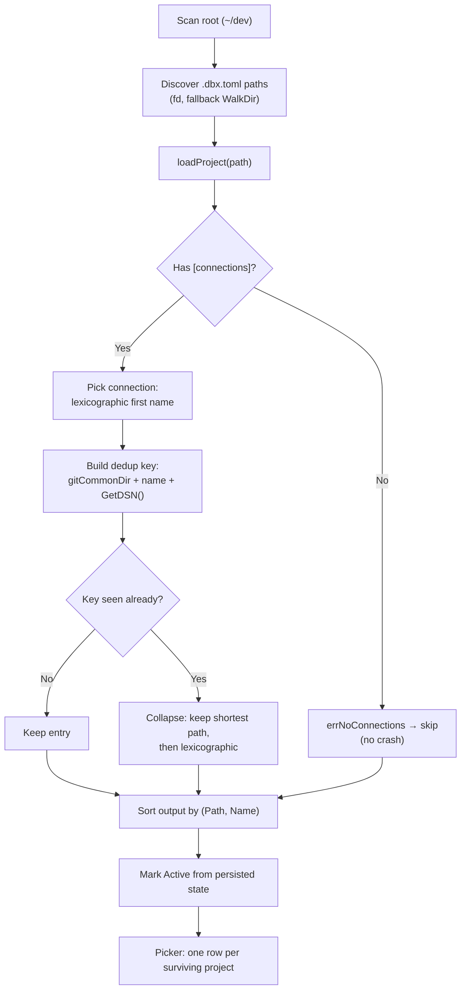
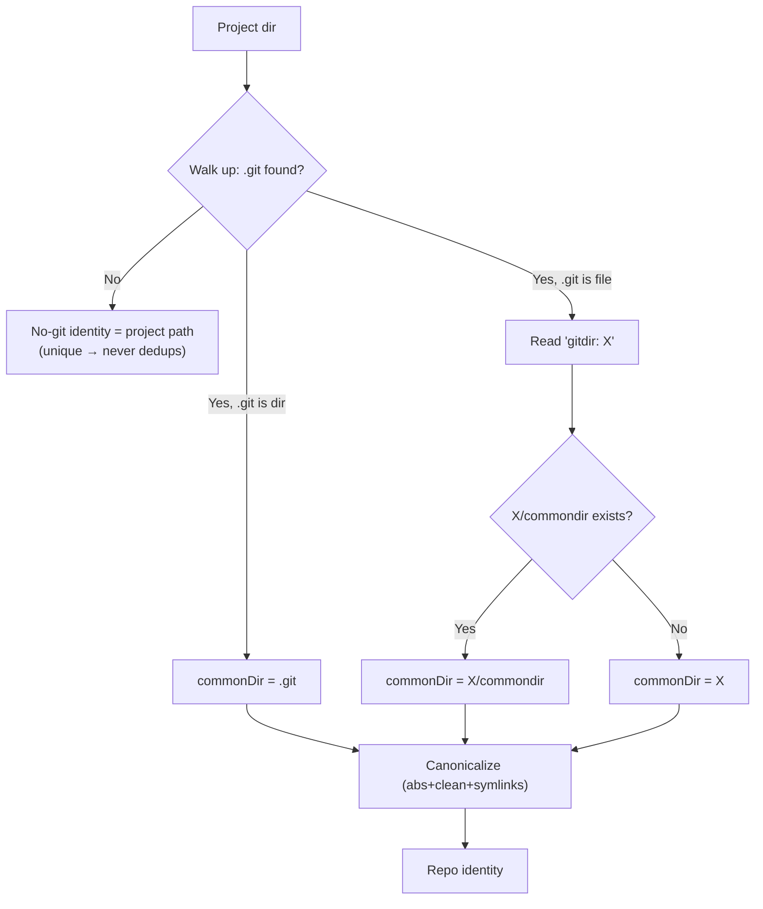

# Feature flow: 0004-fix-dedup-dbx-toml

```mermaid
flowchart TD
    A["Scan root (~/dev)"] --> B["Discover .dbx.toml paths<br/>(fd, fallback WalkDir)"]
    B --> C["loadProject(path)"]
    C --> D{"Has [connections]?"}
    D -- No --> E["errNoConnections → skip<br/>(no crash)"]
    D -- Yes --> F["Pick connection:<br/>lexicographic first name"]
    F --> G["Build dedup key:<br/>gitCommonDir + name + GetDSN()"]
    G --> H{"Key seen already?"}
    H -- No --> I["Keep entry"]
    H -- Yes --> J["Collapse: keep shortest path,<br/>then lexicographic"]
    I --> K["Sort output by (Path, Name)"]
    J --> K
    E --> K
    K --> L["Mark Active from persisted state"]
    L --> M["Picker: one row per surviving project"]
```

## Git identity resolution (no `git` binary)

```mermaid
flowchart TD
    P["Project dir"] --> Q{"Walk up: .git found?"}
    Q -- No --> R["No-git identity = project path<br/>(unique → never dedups)"]
    Q -- "Yes, .git is dir" --> S["commonDir = .git"]
    Q -- "Yes, .git is file" --> T["Read 'gitdir: X'"]
    T --> U{"X/commondir exists?"}
    U -- Yes --> V["commonDir = X/commondir"]
    U -- No --> W["commonDir = X"]
    S --> X["Canonicalize (abs+clean+symlinks)"]
    V --> X
    W --> X
    X --> Y["Repo identity"]
```
