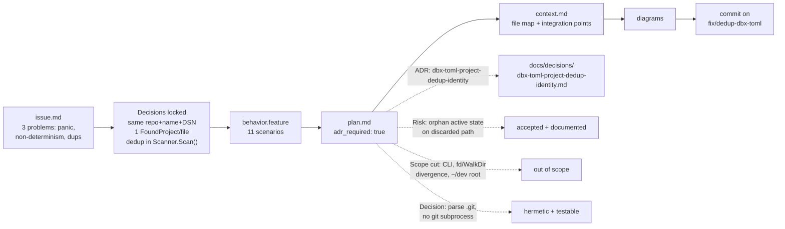

# Planning flow: 0004-fix-dedup-dbx-toml

```mermaid
flowchart LR
    I["issue.md<br/>3 problems: panic,<br/>non-determinism, dups"] --> D["Decisions locked<br/>same repo+name+DSN<br/>1 FoundProject/file<br/>dedup in Scanner.Scan()"]
    D --> B["behavior.feature<br/>11 scenarios"]
    B --> P["plan.md<br/>adr_required: true"]
    P --> C["context.md<br/>file map + integration points"]
    C --> G["diagrams"]
    G --> Z["commit on<br/>fix/dedup-dbx-toml"]

    P -. "ADR: dbx-toml-project-dedup-identity" .-> ADR["docs/decisions/<br/>dbx-toml-project-dedup-identity.md"]
    P -. "Risk: orphan active state<br/>on discarded path" .-> R["accepted + documented"]
    P -. "Scope cut: CLI, fd/WalkDir<br/>divergence, ~/dev root" .-> S["out of scope"]
    P -. "Decision: parse .git,<br/>no git subprocess" .-> GIT["hermetic + testable"]
```
