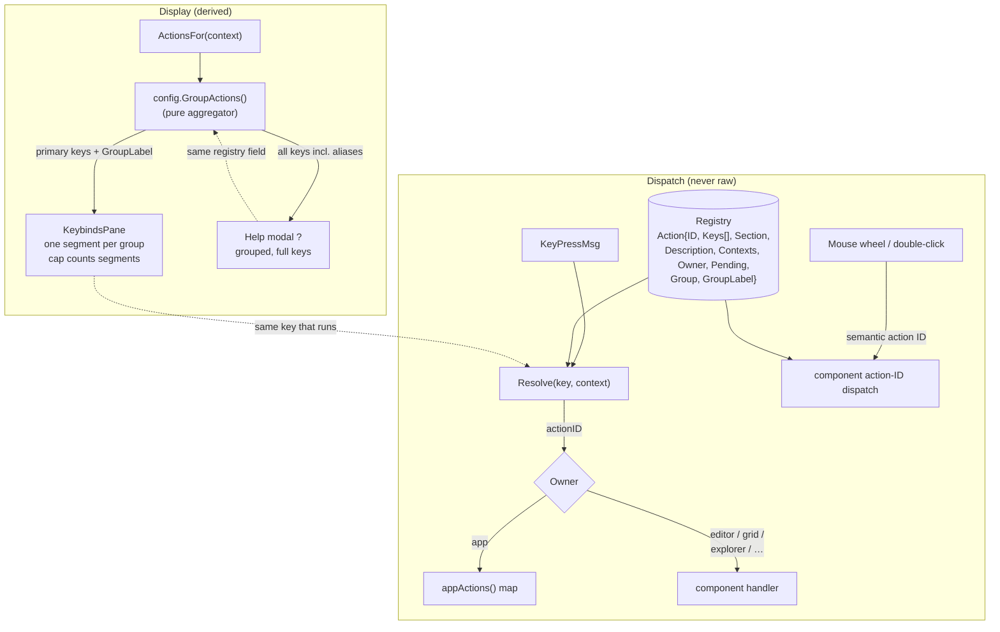
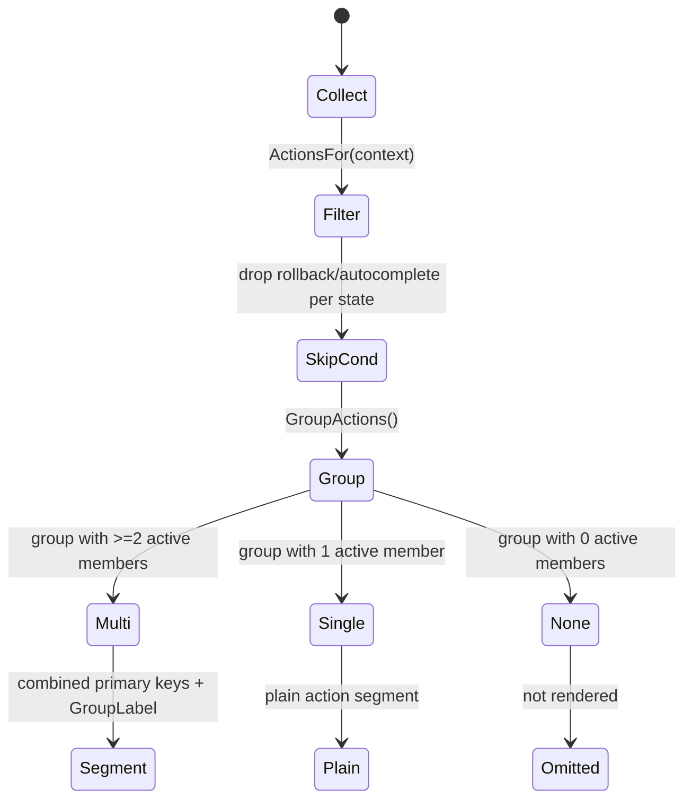
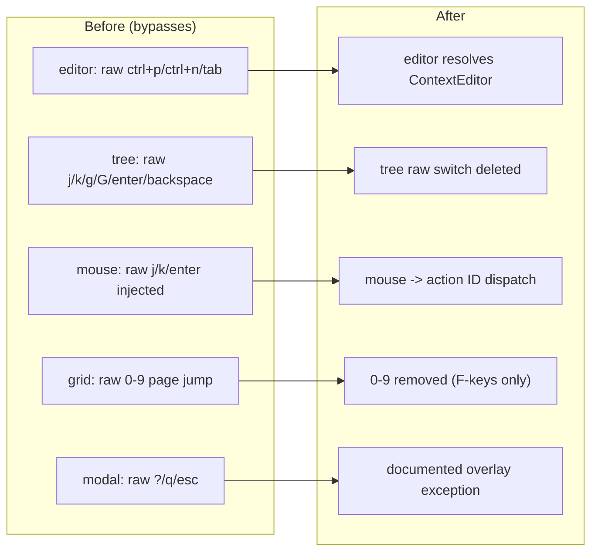

# Feature flow — Keybind grouping + registry hardening

Derived from `behavior.feature`: the registry feeds one grouping path used by both
surfaces, and dispatch never bypasses it.

## Grouping behavior

## Bypass closure (Feature 2)

- Pane: primary keys only; modal: every key (aliases included).
- `hjkl`, `g/G`, `ctrl+u/ctrl+d`, `f1-f9` collapse into single segments.
- Text-entry keys (B) remain widget-local and never resolve to an action.
