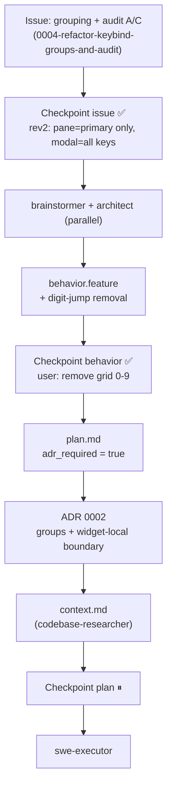
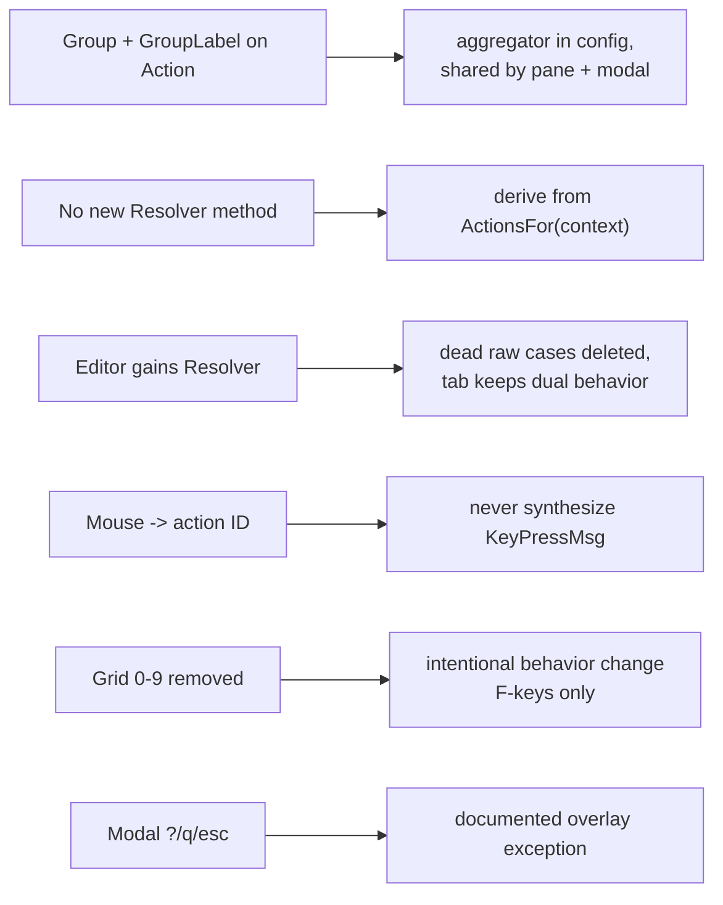

# Process flow — keybind-groups-and-audit

Feature-aware planning flow for THIS change (slug `keybind-groups-and-audit`).

## Decisions made for this change

- **Scope cuts**: widget text-entry keys (B) untouched; no Section grouping; no modal
  registry context; no mouse configurability.
- **ADR**: `0002-keybind-groups-and-widget-local-boundary` (additive `Action` change +
  boundary decisions with discarded alternatives).
- **Numbering note**: `0001` and `0003` already existed, so this plan is `0004`.
