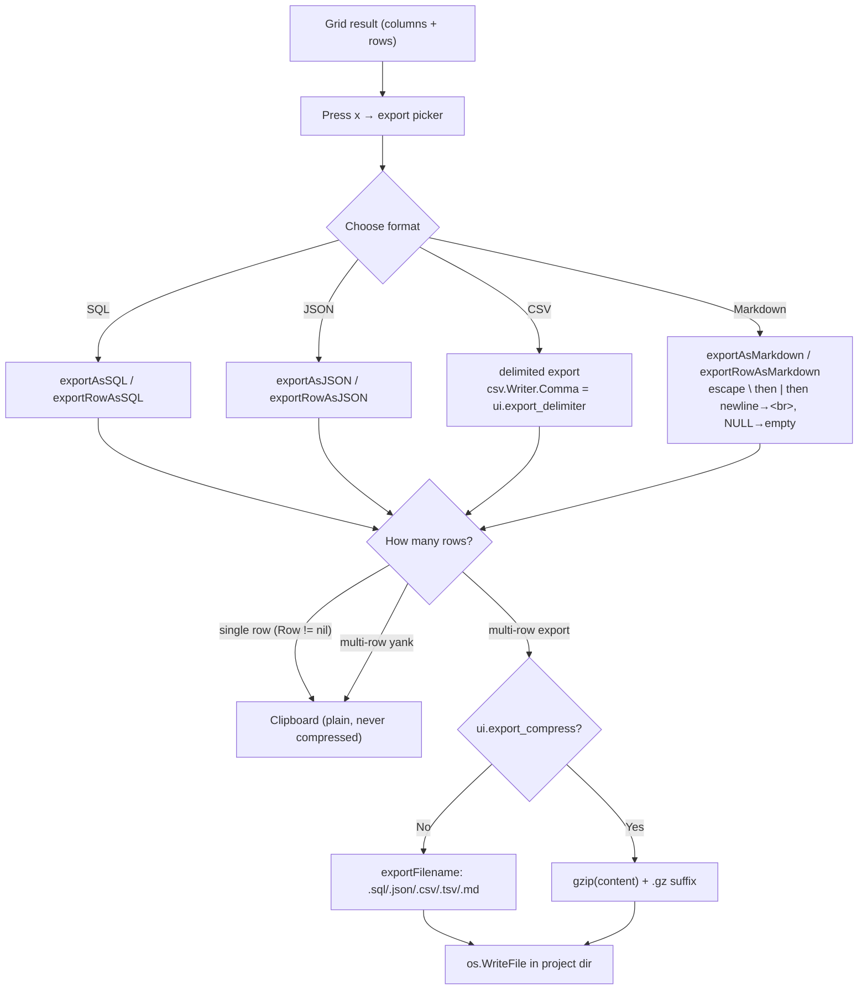
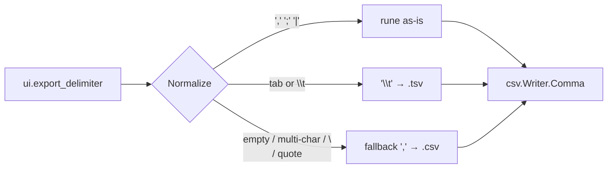

# Feature flow: 0005-feature-export-formats

```mermaid
flowchart TD
    A["Grid result (columns + rows)"] --> B["Press x → export picker"]
    B --> C{"Choose format"}
    C -- SQL --> S1["exportAsSQL / exportRowAsSQL"]
    C -- JSON --> S2["exportAsJSON / exportRowAsJSON"]
    C -- CSV --> S3["delimited export<br/>csv.Writer.Comma = ui.export_delimiter"]
    C -- Markdown --> S4["exportAsMarkdown / exportRowAsMarkdown<br/>escape \ then | then newline→&lt;br&gt;, NULL→empty"]

    S1 --> D{"How many rows?"}
    S2 --> D
    S3 --> D
    S4 --> D

    D -- "single row (Row != nil)" --> CLIP["Clipboard (plain, never compressed)"]
    D -- "multi-row yank" --> CLIP
    D -- "multi-row export" --> E{"ui.export_compress?"}
    E -- No --> F["exportFilename: .sql/.json/.csv/.tsv/.md"]
    E -- Yes --> G["gzip(content) + .gz suffix"]
    F --> H["os.WriteFile in project dir"]
    G --> H
```

## Delimiter and extension rules

```mermaid
flowchart LR
    V["ui.export_delimiter"] --> N{"Normalize"}
    N -- "',' ';' '|'" --> R["rune as-is"]
    N -- "tab or \\t" --> T["'\\t' → .tsv"]
    N -- "empty / multi-char / \\n / quote" --> C["fallback ',' → .csv"]
    R --> W["csv.Writer.Comma"]
    T --> W
    C --> W
```
