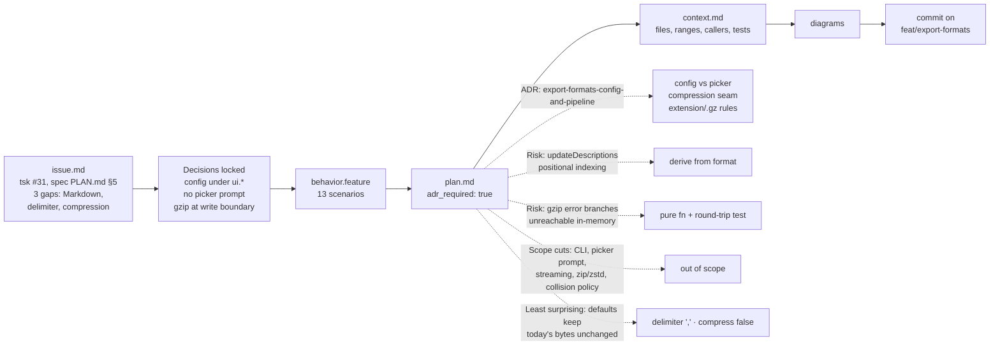

# Planning flow: 0005-feature-export-formats

```mermaid
flowchart LR
    I["issue.md<br/>tsk #31, spec PLAN.md §5<br/>3 gaps: Markdown,<br/>delimiter, compression"] --> D["Decisions locked<br/>config under ui.*<br/>no picker prompt<br/>gzip at write boundary"]
    D --> B["behavior.feature<br/>13 scenarios"]
    B --> P["plan.md<br/>adr_required: true"]
    P --> C["context.md<br/>files, ranges, callers, tests"]
    C --> G["diagrams"]
    G --> Z["commit on<br/>feat/export-formats"]

    P -. "ADR: export-formats-config-and-pipeline" .-> ADR["config vs picker<br/>compression seam<br/>extension/.gz rules"]
    P -. "Risk: updateDescriptions<br/>positional indexing" .-> R1["derive from format"]
    P -. "Risk: gzip error branches<br/>unreachable in-memory" .-> R2["pure fn + round-trip test"]
    P -. "Scope cuts: CLI, picker prompt,<br/>streaming, zip/zstd, collision policy" .-> S["out of scope"]
    P -. "Least surprising: defaults keep<br/>today's bytes unchanged" .-> DEF["delimiter ',' · compress false"]
```
